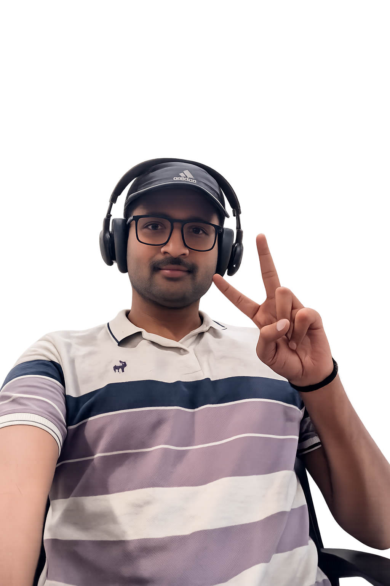

<div align="center">

```
┌─────────────────────────────────────────────────────────┐
│                                                         │
│   > SYSTEM BOOT...                                      │
│   > LOADING PROFILE: ashwini1418                        │
│   > STATUS: ONLINE ██████████ 100%                      │
│                                                         │
└─────────────────────────────────────────────────────────┘
```
<div align="center"> 

  
<p>    </p> </div>
<div align="center">

  


<br/>


</div>

---

<div align="center">

## `📊 github_stats.exe`


&nbsp;&nbsp;

&nbsp;&nbsp;


</div>

---

<details>
<summary align="center"><b>> ✨ CLICK ME ✨</b></summary>

<br/>

<div >

```
Name       :  Ashwini Khodre
From       :  Madhya Pradesh, Bhopal, India
Education  :  Completed B.Tech in Mechanical Engineering
              from IIT Jammu 26'
              
Interests  :  Dev stuff & playing with legos - both involve building cool things!
Currently  :  SWE Tuning Bill, Jaipur
```

</div>

---

<div align="center">

## `> ls skills/`

**// languages**


<br/><br/>

**// frontend & backend**


<br/><br/>

**// databases & devops**


<br/><br/>

**// ai / ml**

```
[ NLP ]  [ LLM Integration ]  [ Transformers ]  [ GLiNER ]  [ DeBERTa ]
[ HuggingFace ]  [ scikit-fuzzy ]  [ NumPy ]  [ Pandas ]  [ Pydantic ]
```

</div>

---

<!-- <div align="center">

## `> cat achievements.log`

```
[★] LeetCode Knight ............ max rating 1,872 | 600+ problems | top 5.12% globally
[★] Google Girl Hackathon 2025 . FINALIST -------- top 1% of all applicants
[★] Flipkart Grid 7.0 .......... SEMI-FINALIST --- top out of 1.5L+ participants
```

</div> -->

---

<div align="center">

## `> ./connect.sh`

[](https://linkedin.com/in/ash1418)
[](https://github.com/ashwini1418)
[](https://leetcode.com/u/Ashwini_gurjar/)
[](https://instagram.com/ashwingurjar_)
[](https://x.com/AshwiniKhodre)
[](https://discord.gg/ash_1418)

<br/>

```
📬  ashwinikhodre@gmail.com
```

</div>

---

<div align="center">

```
> session terminated
> thanks for visiting _
```

&nbsp;


</div>

</details>
